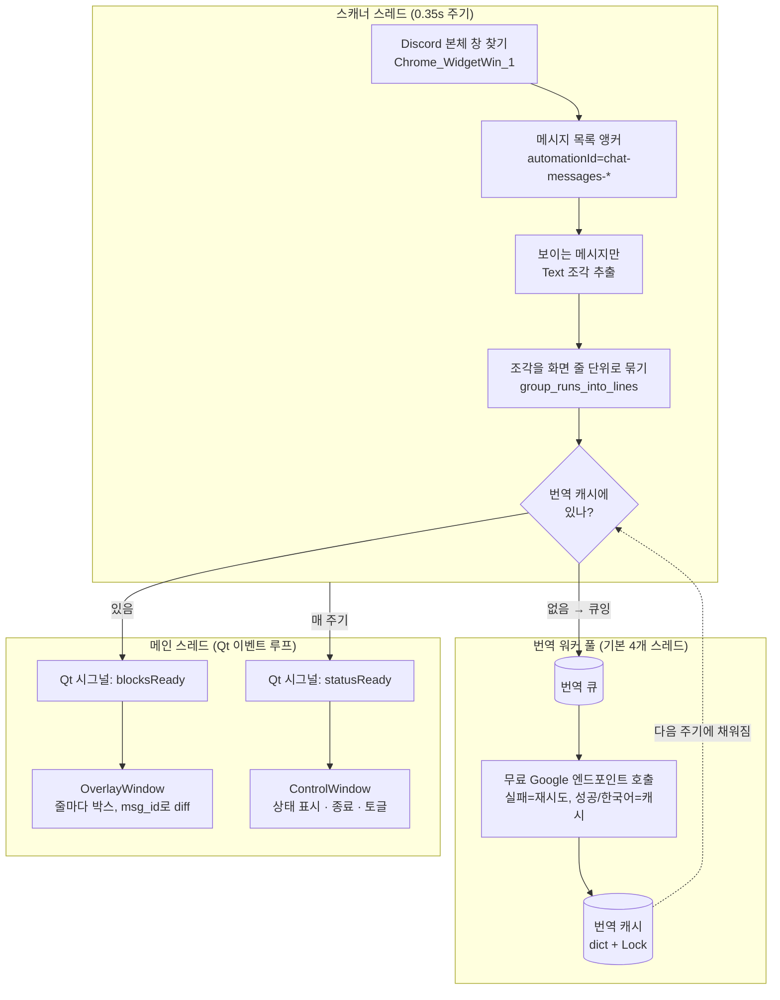

# 아키텍처

세 개의 실행 단위가 Qt 시그널과 스레드 안전한 번역 캐시로 느슨하게 연결된다.
핵심 설계 목표는 **좌표 추적(빨라야 함)과 번역(느린 HTTP)을 분리**해서, 번역을
기다리느라 오버레이가 끊기지 않게 하는 것이다.

## 왜 이렇게 나눴나

- **스캐너 스레드**는 UIA 조회만 한다. 절대 HTTP를 기다리지 않는다. 캐시에 번역이
  없으면 큐에 넣고 바로 다음 메시지로 넘어간다 → 좌표 추적이 매끄럽다.
- **번역 워커 풀**은 큐를 병렬로 비운다. 한 화면에 번역할 줄이 10개 넘게 나오므로
  워커가 하나면 HTTP 왕복이 줄줄이 쌓인다. 실패(네트워크/레이트리밋)와 "한국어라
  번역 불필요"를 구분해, 실패만 점증 backoff로 재시도한다.
- **메인 스레드**는 Qt 규칙상 UI를 건드릴 수 있는 유일한 곳이다. 스캐너/워커는
  UI를 직접 못 만지고 시그널(`blocksReady`, `statusReady`)로만 알린다.

## 모듈 구성

| 모듈 | 책임 | 의존성 |
|---|---|---|
| `discord_screen_overlay.py` | UIA 스캔, Qt 오버레이/조작창, 번역 워커풀 오케스트레이션 | PyQt6, pywinauto |
| `text_filter.py` | 본문 판별·줄 묶기 등 순수 로직 | 없음 (stdlib) |
| `config.py` | 설정 로딩(ini/환경변수/기본값) | 없음 (stdlib) |
| `inspect_discord_tree.py` | 진단·벤치마크, 결과 생성 | pywinauto |

`text_filter`와 `config`를 의존성 없는 순수 모듈로 뽑아낸 덕에, 로직의 핵심을
어떤 OS의 CI에서도 PyQt6/pywinauto 없이 단위 테스트할 수 있다(`tests/`).
